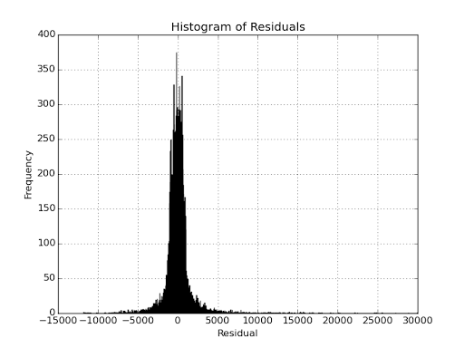
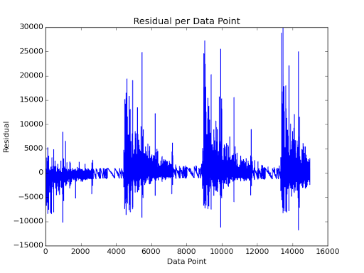

##Section 1. Statistical Test
####1.1 Which statistical test did you use to analyze the NYC subway data? Did you use a one-tail or a two-tail P value? What is the null hypothesis? What is your p-critical value?
After conducting a two-tailed Mann-Whitney U test, I concluded that there is sufficient evidence to reject the null hypothesis of both samples coming from the same population at 5% significance (p-critical = 0.05). The Mann-Whitney U test gave a p value of 0.0249. As this defaults to a one sided test, doubling it gives us the two tailed p-value, which gives 0.0498 meaning it is barely significant at the 5% level.

####1.2 Why is this statistical test applicable to the dataset? In particular, consider the assumptions that the test is making about the distribution of ridership in the two samples.
If we could assume that both samples were normally distributed, a t-test would be preferable. After plotting both samples on a historgram, we can see that neither are normally distributed. As a result, a good choice for a test to examine whether both samples are drawn from the same population would be the Mann-Whitney U test. 

####1.3 What results did you get from this statistical test? These should include the following numerical values: p-values, as well as the means for each of the two samples under test.
The results were as follows:

* U  -> 1924409167.0
* mean (rain)  -> 1105.446
* mean (no rain) -> 1090.279
* p-value ->  0.025
 
(answers rounded to 3 decimal places)

####1.4 What is the significance and interpretation of these results?
Such a low p-value suggests that there is strong evidence that the two samples are drawn from different populations. This experiment was comparing the subway ridership after having divided the data into two samples based on whether or not it was raining. In simpler language, a difference between these samples suggests that there is a difference in subway ridership when it is raining compared to when it is not.  *Mean (rain)* is higher than *mean (no rain)* suggesting that more people ride the subway when it is raining than when it is not.

##Section 2. Linear Regression
####2.1 What approach did you use to compute the coefficients theta and produce prediction for ENTRIESn_hourly in your regression model:
I used OLS from the StatsModels module. The code was as follows:

	def linear_regression(features, values):
    """
    Perform linear regression given a data set with an arbitrary number of features.
    """
    	features = sm.add_constant(features)
    	model = sm.OLS(values, features)
    	results = model.fit()
    	intercept = results.params[0]
    	params = results.params[1:]
    
    	return intercept, params

####2.2 What features (input variables) did you use in your model? Did you use any dummy variables as part of your features?
The explanatory variables used were: 
* 'rain' - whether or not it was raining (1 = raining)
* 'precipi' - the level of precipitation at that time and location
* 'Hour' - hour of the timestamp
* 'meantempi' - the daily average of the temperature in Fº at that location

'UNIT' was included as a dummy variable. UNIT contains an identifier for the unit that collected the turnstile information. Each unit can collect from multiple banks of turnstiles and some stations may have more than one unit. In general, this acts as a reasonable proxy for station.

####2.3 Why did you select these features in your model? 
Intuition would suggest that the time of day would play a big part in the ridership, so it made sense that this be included. Assuming weather impacts ridership, we would suppose that rain and temperature would have an impact on ridership so those were included also. I found that including 'precipi' as well as rain led to a higher R2 value so I left it in. This could cause other problems which I highlight in my answer to 5.1.

####2.4 What are the parameters (also known as "coefficients" or "weights") of the non-dummy features in your linear regression model?
intercept: 1539.12679304
coefficients: 2.94645287e+01 2.87263803e+01   6.53345653e+01  -1.05318249e+01
The equation would be written:
ENTRIESn_hourly = 1539.12679304 + 2.94645287e+01 * rain + 2.87263803e+01 * precipi + 6.53345653e+01 * Hour + -1.05318249e+01 * meantempi

####2.5 What is your model’s R2 (coefficients of determination) value?
0.47924770782

####2.6 What does this R2 value mean for the goodness of fit for your regression model? Do you think this linear model to predict ridership is appropriate for this dataset, given this R2  value?
This means that approximately 48% of the relationship is explained by the parameters included in the model with the rest of the variability in ridership contained within the residuals. This suggests that the model has some explanatory power, but that there is a good amount of room for improvement. 

An alternative method for gaining an insight into the goodness of fit of the model would be to plot the residuals. 

At first glance, the residuals seem to have a near normal distribution. This would imply that the linear model offers a reasonable approximation of the data. However, if we instead plot the residuals per data point, we see another story:

This suggests that the residuals aren't normally distributed, but are instead following a cyclical, non-linear pattern and that a non-linear model would better fit the data. 

##Section 3. Visualization
Please include two visualizations that show the relationships between two or more variables in the NYC subway data.
Remember to add appropriate titles and axes labels to your plots. Also, please add a short description below each figure commenting on the key insights depicted in the figure.
####3.1 One visualization should contain two histograms: one of  ENTRIESn_hourly for rainy days and one of ENTRIESn_hourly for non-rainy days.

This depicts the total number of riders in the subway system when it is raining and when it is not. These are aggregate numbers over the whole time period that data was collected, which explains why it appears that ridership was higher when it wasn't raining versus when it was. This is simply due to the higher number of dry days than wet days. The key point to note here is that the data is not normally distributed, meaning that a t-test would not be a suitable statistical test for this data.

####3.2 One visualization can be more freeform. You should feel free to implement something that we discussed in class (e.g., scatter plots, line plots) or attempt to implement something more advanced if you'd like. 

This depicts the total number of riders on the NYC Subway per day where the week is shown from Sunday to Saturday. As expected, there is a peak from Monday to Friday. The comparatively low number of riders on Mondays can be explained by the fact that there was a holiday Monday in the dataset and these are total figures across the month. There is no obvious explanation for the slight dip in ridership on Thursday and this requires further investigation. A possible explanation would be people going out after work on a Thursday evening and taking a taxi home instead of the subway. 

##Section 4. Conclusion
Please address the following questions in detail. Your answers should be 1-2 paragraphs long.
####4.1 From your analysis and interpretation of the data, do more people ride the NYC subway when it is raining or when it is not raining?  
Looking firstly at the Histogram from question 3.1, we see the distribution of entries into the subway network when it is raining and when it is not raining. We note that there his a far higher frequency of no entries when it is not raining vs when it is. However, it's important to note that it is overall frequency over the course of the overall sample and that there were fewer rainy days than not, which explains the disparity.

The histogram does provide some useful insight in that it allows us to see that the data are not normally distributed which led to the use of the Mann-Whitney U test for analysis. After running the test on two samples - one for entries when raining and the other for entries when there was no rain -  the test returned a U statistic of 1924409167.0 with a corresponding p value of approximately 0.025. 

Also, in the regression analysis conducted, both 'rain' and 'precipi' have a positive coefficient, implying that ridership increases when 'rain' and 'precipi' are positive. From this I conclude that there is sufficient evidence of an increase in subway ridership when it is raining vs when it is not.

####4.2 What analyses lead you to this conclusion? You should use results from both your statistical tests and your linear regression to support your analysis.
see 4.1

##Section 5. Reflection
Please address the following questions in detail. Your answers should be 1-2 paragraphs long.
####5.1 Please discuss potential shortcomings of the methods of your analysis:
#####Issues with the dataset
Many of the issues with the original dataset were addressed with the improved dataset. The additional data on the Station and the introduction of a weekday variable would have been useful for the regression analysis. 

One of the biggest issues with both datasets is how time is managed. The day is divided into four hour blocks (00:00-03:59, 04:00-07:59, etc) and all entries and exits are stored within these blocks. This makes it difficult to analyse exactly when people are more likely to ride the subway, as an entry at 4am is counted the same as an entry at 7:30am and an entry at 8:01am is counted the same as an entry at 11:45am. The lack of granularity means that it is hard to draw conclusions on true rush hours and peak ridership, and this may go some way to explaining why our regression analysis had comparatively little explanatory power.

Aside from the issues with the structure of the data, there are also some issues with the sanity of the data. The most troubling of these is that certain days don't have data for all 6 time blocks in a day. It is unclear whether this is because the data has been segmented differently (e.g. one eight-hour time block instead of two four-hour time blocks) or if this is because of missing data. There are also records of zero entries and exits at various points in the dataset. This could be due to a temporary station closure, time of day or a machine being out of order. It seems unlikely, however, that there would be no entries nor exits throughout a 24 hour period which leads me to conclude that there were errors with the data collection, casting doubt over any conclusions reached from analysis of the data.

#####Issues with analysis
The regression analysis makes use of 'precipi' and 'rain' which both describe the same thing and are therefore likely to be highly correlated. This could cause multicollinearity and lead to our regression coefficients being invalid. It would therefore be preferable to include only one of the two variables as although this would lead to a lower r^2, it would lead to greater accuracy of the coefficients. 

####5.2 (Optional) Do you have any other insight about the dataset that you would like to share with us?
Initially I had thought that the disparity between entries and exits, both hourly and totals, was cause for concern but after thinking about it in more depth I can see that this should be expected. For example, it would make sense that Woodhaven Boulevard would have more entries than exits at 7am, with the inverse being true at 8pm. 

#####References
http://en.wikipedia.org/wiki/Mann%E2%80%93Whitney_U_test
http://chrisalbon.com/python/matplotlib_histogram.html
https://github.com/allanbreyes/udacity-data-science/blob/master/p1/ps4/plot_entries_by_day_of_week.py
http://statsmodels.sourceforge.net/0.5.0/generated/statsmodels.regression.linear_model.OLS.html
